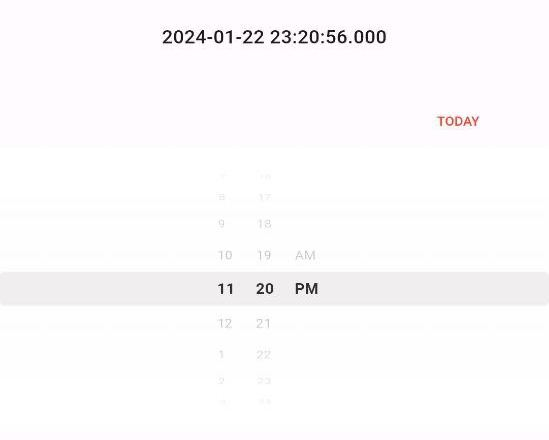

# Scroll Time Picker

[](https://pub.dev/packages/flutter_map_location_picker)
[](https://pub.dev/packages/scroll_time_picker/score)
[](https://pub.dev/packages/scroll_time_picker/score)

A scroll time picker widget for flutter.

## Screenshots



## Getting Started

Add this to your `pubspec.yaml`:

```yaml
dependencies:
  your_package_name: ^1.0.0
```
## Usage

```dart
ScrollTimePicker(
  selectedTime: _selectedTime,
  is12hFormat: true,
  onDateTimeChanged: (DateTime value) {
    setState(() {
      _selectedTime = value;
    });
  },
)
```

## Contribution

We welcome contributions! Feel free to open issues or submit pull requests.

## Inspired by

- [scroll_date_picker](https://pub.dev/packages/scroll_date_picker)

# License

This package is licensed under the Apache V2 License - see the [LICENSE](https://github.com/azisanw19/flutter-scroll-time-picker/blob/main/LICENSE) file for details.